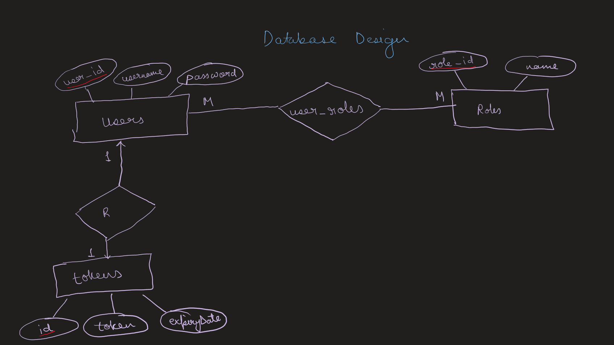

# Expanse Tracker App – Backend

Project Description:
This project focuses on building the backend of an Expense Tracker application using Spring Boot.

## Day 1:
- Project initialization
- Designing the entity layer
- Defining relationships between entities

ER diagram And Relationship between each entity:
## Database Design

## Day 2
- Restructured packages for better separation of concerns
- Implemented `JwtService` for JWT generation and validation
- Implemented `CustomUserDetails` as a bridge between database users and Spring Security
- CustomUserDetails converts database user into a format that Spring Security understands.
- Studied access token vs refresh token concepts
- Defined token-based authentication flow for client requests

## Day 3
- Implemented Spring Security `UserDetailsService` to authenticate users from the database
- Integrated `CustomUserDetails` as the security adapter for role-based authorization
- Designed refresh token mechanism for session continuity
- Implemented refresh token creation, validation, and expiry handling
- Used Spring Data `CrudRepository` for user and token persistence
- Strengthened understanding of authentication flow and token lifecycle

## Day 4
- Designed request and response DTOs for authentication flow
- DTOs define what data is allowed to cross the API boundary.
- Integrated DTOs into signup, login, and token refresh workflows

## Day 5
- Implemented JWT-based authentication filter
- Configured Spring Security with stateless session management
- Integrated custom JwtAuthFilter into the security filter chain
- Wired AuthenticationManager and AuthenticationProvider for login flow
- Defined public and protected API endpoints

## Day 6
- Implemented /signup and /login mapping
- Implemented how Access token will be generated using Refresh Token

## Day 7
- Starting of Implementation of Expense Tracker App Logic
- Implemented Expense entity and ExpenseRepository
- Enums are used to create fixed Expense type and category
- Do not use FindById alone because this returns expense regardless of owner which can lead to data leaks.

## Day 8
- Implementing ExpenseService and ExpenseController
- PostMapping -> CreateExpense, GetMappng -> getExpenseById, GetMappng -> getAllExpenses, DeleteMapping -> deleteExpenses.

## Day 9
- Implemented Update feature. ExpenseUpdateRequestDto,ExpenseUpdateService,ExpenseUpdateServiceImplementation,ExpenseController.
- PutMapping-> updateExpenses

## Day 10
- Implemented Global Exception Handler
- HandleValidationException-> Bad Request, HandleEntityNotFound-> Not Found, HandleGenericException -> Internal Server Error
- @ControllerAdvice: Globally intercepts exceptions thrown by controllers and routes them to appropriate handler methods.
- @ExceptionHandler: Maps a specific exception type to a method that converts it into an HTTP response.
- getBindingResult(): Retrieves detailed field-level validation errors generated during request binding.

## Day 11
- Adding Expense Tracker Feature.
- Using can now analyzie thier monthly,date wise,categorywise expenses. Can check now much daily avg spending and also top category in which most money is spend.
- Implemented CategoryReportDto, DashboardDto, ExpenseSummaryDto, MonthlyReportDto.
- Implemented ReportService do define logic Expense tracking.

## Day 12
- Implementing Api end points to integerate tracking and reporting feature.
- Implemented ReportController class with GetMapping-> monthly,category,dashboard

## Day 13
- Optimizing getAllExpenses() feature by integerating it with InvalidDateRangeException.
- Implemented InvalidDateRangeException class to handle if start date is after the end date and GolbalExceptionHandler handles Invalid Date Range.

## Day 14
- Implementing CSV Export feature. Now User can download their expenses as CSV. 
- Reusing findAllByUserIdAndExpenseDateBetween(...).
- Changed some getAllExpense endPoints.
- We fetch the user’s expenses from the database, write them into a CSV format in memory using a StringWriter and CSVPrinter, convert that to a byte array, and return it in the HTTP response with download headers.
- We are using the Apache Commons CSV dependency:
org.apache.commons:commons-csv to generate and format the CSV file safely.

## Day 15
- Implementing Caching. Default Spring Caching is used.
- @EnableCaching in main application class. This activates Spring’s cache abstraction.
- In your ReportService use @Cacheable at getDashboard(). 
- DB queried → result stored in cache. Returned directly from memory. No DB hit.
- Whenever expense is created/updated/deleted: 
- In ExpenseServiceImplementation @CacheEvict at createExpense()
- In ExpenseServiceImplementation  @CacheEvict at deleteExpense()
- In ExpenseUpdateServiceImplementation @CacheEvict at updateExpenses()

## Day 16
- Implementing Junit testing on ExpenseServiceImplementation. This class contains: Business rules, Date validation logic, Mapping logic, Delete validation, CSV export validation. This is the brain of our system.
- Methods to be tested: 
1: getAllExpenses(...): Because it contains Date validation logic, Throws custom exceptions, Critical filtering behavior. Test: from > to → exception, only one date → exception, valid dates → repository called. Type: Unit Test (Mockito).

2: createExpense(...): Because it contains Core write operation, Maps DTO → Entity → DTO, Critical business operation.Test: Repository save is called, Returned DTO matches expected. Type: Unit Test (Mockito).

3: deleteExpense(...): Because it validate ownership, Must throw if not found. Test: When expense exists → delete called, When not exists → exception thrown. Type: Unit Test.

- All tests are passed successfully.

## Day 17
- Implemented ExpenseUpdateServiceImplementationTest. 
- Implemented RepositoryTest. It Validates SQL queries, JPQL queries, Grouping, Aggregations, Filtering, Index behavior, Entity mapping, Column constraints.
- @DataJpaTest is used. Starts only JPA layer.  It loads: Entity classes, Repository beans, Embedded H2 database. It does NOT load: Controllers, Services, Security, Full Spring Boot context. This is called a slice test.
- Implemented Controller Integeration Test. This validates: URL mapping, Request parameter binding, Authentication extraction, Service call, Database access, JSON serialization, HTTP status codes, Global exception handling.
- SpringBootTest & @AutoConfigureMockMvc is used. This loads the entire Spring Boot application. Not a slice. Full system.

## Day 19
- Implemented Swagger UI. Swagger UI is a web-based interface generated from OpenAPI specifications that allows developers to visualize, explore, and test REST APIs directly from the browser without external tools like Postman.
- API documentation is a structured contract that describes endpoints, request/response models, parameters, authentication mechanisms, and error formats — ensuring clear communication between backend and frontend or third-party consumers.
- Why We Prefer Swagger: Eliminates manual documentation errors, Auto-generates documentation from code, Enables real-time API testing, Acts as a living API contract.
- Added springdoc-openapi dependency, Customized Swagger UI path (/docs), Integrated JWT authentication with Bearer token support, Configured security to permit Swagger endpoints, Updated JWT filter to bypass Swagger routes properly, Fixed Pageable rendering using @ParameterObject, Structured API tags for clean grouping.
- 

## Testing and Bug Fixing 1
- Tested all 3 apis.
- A critical issue was identified in the authentication flow.
- During **signup**, a refresh token was generated and stored in the database along with the user ID.
- On **login**, the system attempted to generate and persist another refresh token for the same user.
- Since the `tokens` table enforces a **one-to-one relationship** between user and refresh token (unique `user_id`), this resulted in a **duplicate key constraint violation**.
- The root cause was improper refresh token lifecycle management.
- Enforced a **single active refresh token per user**.
- On login (and signup), any existing refresh token for the user is deleted before creating a new one.
- This ensures token rotation instead of duplication and aligns with standard security practices.
- Signup and login flows now work correctly.
- No duplicate token collisions occur.
- Authentication is stable and production-ready.

## Testing and Bug Fixing 2
- Tested all 3 apis.
- Critical issue was in last two dasy work I have taken userId as Long but earlier it was defined as String.
- All apis are correctly inserting,retrieving and deleting data.

## Testing and Bug Fixing 3
- Tested all 3 apis.
- There was issue in Query of MonthlyExpenses. We were using expense_date (full date) with year and month. Sql strictness has blocked us. we only have to make year(expense_date) and month(expense_date) only year and month of date with year and month in group by.
- All apis are correctly fetching and calculating data.

## Testing and Bug Fixing 4
- Tested Date range filter api.
- There was some typos which were fixed.
- Api is working correctly and GlobalExceptionHandler is correctly handeling valid date format.

### Classes Explained:

### Entity Classes

- **UserDetails**
    Represents a user record in the database, storing login credentials and profile identifiers.

- **UserRole**
    Defines authorization roles assigned to users for access control.

- **RefreshToken**
    Stores long-lived refresh tokens used to generate new access tokens without re-authentication.

- **Expense**
    Defing what is Expense and what type of Expense.

### Repository Classes

- **UserRepository**
    Provides database operations to fetch and persist user records using Spring Data.

- **RefreshTokenRepository**
    Manages CRUD operations for refresh tokens and token lookup.

- **ExpenseRepository**
    Tracking user expense using: UserId+Id, UserId, UserId+FromDate+ToDate, UserId+ExpenseCategory

### Service Classes

- **UserDetailsServiceImplementation**
    Loads user data from the database and adapts it to Spring Security’s authentication model.

- **CustomUserDetails**
    Converts the user entity into a security-safe representation required by Spring Security.

- **JwtService**
    Handles JWT creation, validation, and claim extraction for stateless authentication.

- **RefreshTokenService**
    Creates, validates, and expires refresh tokens for session continuity.

- **ExpenseService**
    Defines the business contract for expense operations, decoupling controllers from implementation details.

- **ExpenseServiceImplementation**
    Contains the actual business logic that fulfills the service contract and coordinates repositories and domain rules.

- **ExpenseUpdateService**
    Defines the contract for updating an expense while enforcing business rules.

- **ExpenseUpdateServiceImplementation**
    Implements controlled mutation of an existing expense after verifying ownership.

- **ReportService**
    Implements logic of how to calculate, summarize and generate report on expense.

### DTO Classes

- **AuthRequestDto**  
    Carries username and password from the client during login requests.

- **UserDetailsDto**  
    Transfers user registration and profile data during signup without exposing entity internals.

- **JwtResponseDto**  
    Sends access token and refresh token to the client after successful authentication.

- **RefreshTokenRequestDto**  
    Carries refresh token from client to request a new access token.

- **ExpenseCreateRequestDto**
    Represents and validates client input data used to create a new expense, protecting the domain from invalid requests.

- **ExpenseResponseDto**
    Represents the structured, read-only data returned to the client after processing an expense operation.

- **ExpenseUpdateRequestDto**
    Carries and validates client input data for updating an existing expense.

- **CategoryReportDto**
    Represents, Tracks and validates Category wise Expenses.

- **DashboardDto**
    Geneartes Dashboard for all expense tracking feature.

- **ExpenseSummaryDto**
    Summarizes Total expense.

- **MonthlyReportDto**
    Represents, Tracks and validates Month wise Expenses

### Auth Classes

- **JwtConfig**
    Validates token of each request

- **UserConfig**
    Declares PasswordEncoder and its Algo

- **SecurityConfig**
    Defines Security rulebook, checks which requests are public and which need authentication.
    How Authentication should happen and which filter should run in what order.

### Controller Classes
- **AuthController**
    This class implements /signup and /login request: creates user, authenticate user, generate access token(jwt), generate refresh token and return both.

- **TokenController**
    This class generates new access token from refresh token.

- **ExpenseController**
    Exposes REST APIs, validates requests, extracts user context, and delegates all business work to the service layer.

### Domain Enums
- An enum is a closed, finite set of valid values defined at compile time. These are the only values that can ever exist.

### Exception classes
- **EntityNotFoundException**
    Thrown when a requested database entity does not exist.

- **ApiErrorResponse**
    Standardizes the structure of error responses returned to the client.

- **InvalidDateRangeException**
    Standardized the structure of error if start date comes after end date (Invalid date format).